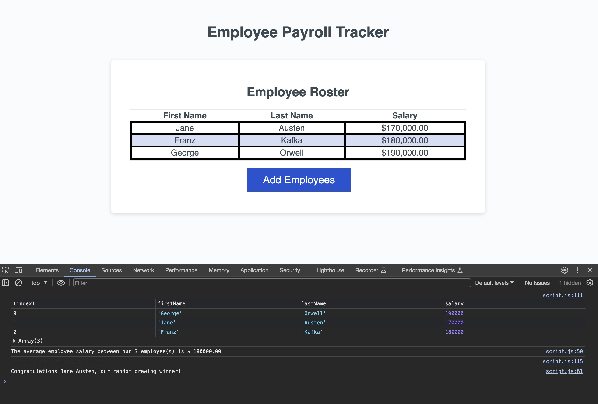

# employee_payroll_tracker

## Description 

### This application allows an employer to enter the names of employees and their salaries. The application will then output a chart of the information as well as give the average salary and name a lucky random winner.

## Technologies

### HTML, CSS, and JavaScript

## Deployed Application

### https://jlvstrasse.github.io/employee_payroll_tracker/